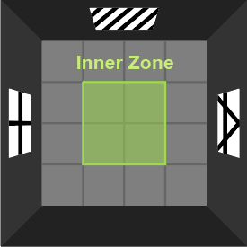

# Dory Behavioural Analysis
Analysis scripts for rat behavioural experiments. These scripts were applied following body part tracking in DeepLabCut and behavioural classification in SimBA.

## Methods
### Body part tracking in [DeepLabCut](https://github.com/DeepLabCut/DeepLabCut)
To track rat body parts in open field, novel object recognition (NOR), object location task (OLT) and Barnes maze experiments, [DeepLabCut](https://doi.org/10.1038/s41593-018-0209-y) (version 3.0.0rc9) was run using the [UNSW Katana](https://doi.org/10.26190/669x-a286) computational cluster. The labelling scheme is shown in Figure 1. A [ResNet-50](https://doi.org/10.48550/arXiv.1512.03385)-based neural network was trained, with 95% train-test split, a batch size of 8 and all other default parameters. This model was trained on 1525 labelled frames across 77 videos (25 frames per second). After 400 epochs, the test root mean square error (RMSE) was 10.9 mm for predictions with greater than 60% confidence. 

**Figure 1: Labelling scheme for DeepLabCut body part tracking.** Image credit: Rowan Heggen, 2026.

### Analysis in [Simple Behavioral Analysis (SimBA)](https://github.com/sgoldenlab/simba/tree/master) and [R](https://www.R-project.org/)
Following body part tracking, the rats' movement and behaviours were analysed using [Simple Behavioral Analysis (SimBA)](https://doi.org/10.1038/s41593-024-01649-9) (versions 4.1.6–4.6.7), with scaling factors determined in [ImageJ](https://doi.org/10.1038/nmeth.2089). Any videos that ended significantly prematurely, commenced significantly late, or had other notable disruptions were excluded from the analysis. An explanation of each experiment's analysis is provided below.

#### Open Field
For the open field test, the arena's centre zone was defined as its four inner squares, constituting a quarter of its area. After defining a region of interest (ROI) in SimBA, the duration for which the rats' noses were within this boundary was determined. In R, value was divided by the total duration of the experiment to calculate the percentage of time in the centre zone. The total distance travelled was also calculated, defined as the distance travelled by a rat's centre of mass.

$\textrm{\% Inner} = \frac{\textrm{Duration in Inner ROI}}{\textrm{Length of video}}$

#### Novel Object Recognition and Object Location Tests
To analyse NOR and OLT, SimBA ROIs were drawn around the objects, and models were trained to classify object directed interaction. Interaction was defined as the rat being within 2 cm of an object with its nose oriented toward it. Frames in which rats were resting on or rearing against the object were excluded from the positive class. A total of 21 videos were manually annotated for model training (315,000 frames total, with ~11,000 frames in the positive class for each behaviour), and 20% of frames were held out as a test set. A Random Forest classifier (2,000 estimators) was trained using SimBA’s default feature extraction pipeline. After classification, a minimum bout length of 250 ms was applied to reduce spurious detections. Automated predictions were verified by both comparison of numerical output to a manually scored subset of videos, and inspection of machine-labelled videos.

### Barnes Maze
To analyse the Barnes maze, ROIs were drawn around each of its 18 holes in SimBA. The aggregate ROI data and detailed sequences were outputted for analysis of B

